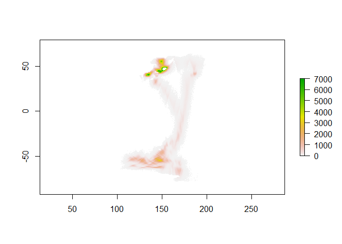

[](https://travis-ci.org/mdsumner/splat)

<!-- README.md is generated from README.Rmd. Please edit that file -->
``` r
load("D:/twotera/GIT/splat/bulkdata/082_WI_MARCH2013fitSST.RData")
#load("bulkdata/19747_WI_DEC2011fitSST.RData")
library(raster)
#> Loading required package: sp
library(splat)
library(dplyr)
#> 
#> Attaching package: 'dplyr'
#> The following objects are masked from 'package:raster':
#> 
#>     intersect, select, union
#> The following objects are masked from 'package:stats':
#> 
#>     filter, lag
#> The following objects are masked from 'package:base':
#> 
#>     intersect, setdiff, setequal, union
system.time(
  sx <- splat(fit)
)
#>    user  system elapsed 
#>    3.05    0.37    3.42

r <- attr(sx, "grid")
ssx <- sx %>% group_by(cell) %>% summarize(bin = sum(bin))
r[ssx$cell] <- ssx$bin
plot(r, zlim = c(0, 7e3))
```



``` r

print(format(object.size(fit), units = "Mb"))
#> [1] "219.6 Mb"
str(fit)
#> List of 3
#>  $ model:List of 12
#>   ..$ logpx        :function (x)  
#>   ..$ logpz        :function (p)  
#>   .. ..- attr(*, "srcref")=Class 'srcref'  atomic [1:8] 11 16 14 1 16 1 11 14
#>   .. .. .. ..- attr(*, "srcfile")=Classes 'srcfilecopy', 'srcfile' <environment: 0x0000000017fa7798> 
#>   ..$ residuals    :function (x)  
#>   ..$ fixedx       : logi [1:600] FALSE FALSE FALSE FALSE FALSE FALSE ...
#>   ..$ estelle.logpb:function (x, z)  
#>   ..$ stella.logpb :function (x)  
#>   ..$ beta         : num [1, 1:2] 2.8 0.12
#>   ..$ dt           : num [1:599] 11.7 11.6 12.2 11.6 12.5 ...
#>   ..$ x0           :List of 1
#>   .. ..$ : num [1:600, 1:2] 159 162 166 168 171 ...
#>   ..$ z0           :List of 1
#>   .. ..$ : num [1:599, 1:2] 162 165 166 166 169 ...
#>   ..$ time         : POSIXct[1:600], format: "2013-04-03 07:34:40" ...
#>   ..$ rise         : logi [1:600] FALSE TRUE FALSE TRUE FALSE TRUE ...
#>  $ x    :List of 4
#>   ..$ : num [1:600, 1:2, 1:3000] 158 164 166 169 164 ...
#>   ..$ : num [1:600, 1:2, 1:3000] 157 165 167 166 166 ...
#>   ..$ : num [1:600, 1:2, 1:3000] 155 164 168 168 165 ...
#>   ..$ : num [1:600, 1:2, 1:3000] 159 161 165 166 170 ...
#>  $ z    :List of 4
#>   ..$ : num [1:599, 1:2, 1:3000] 158 164 165 168 169 ...
#>   ..$ : num [1:599, 1:2, 1:3000] 163 168 167 167 165 ...
#>   ..$ : num [1:599, 1:2, 1:3000] 154 168 166 166 168 ...
#>   ..$ : num [1:599, 1:2, 1:3000] 164 161 165 170 170 ...
```
